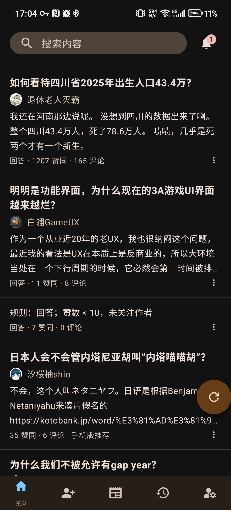
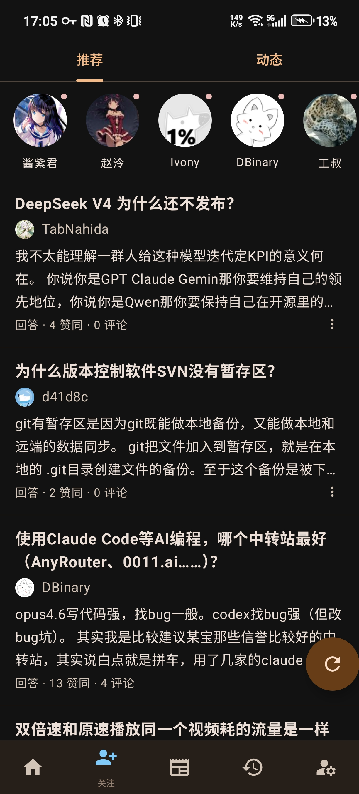
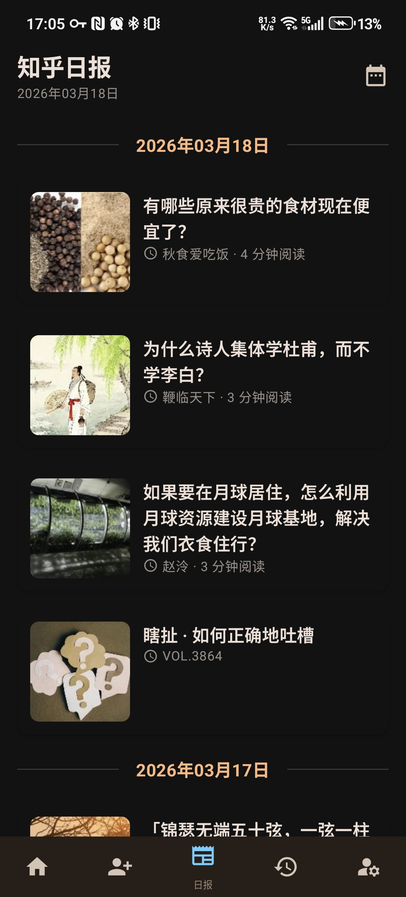
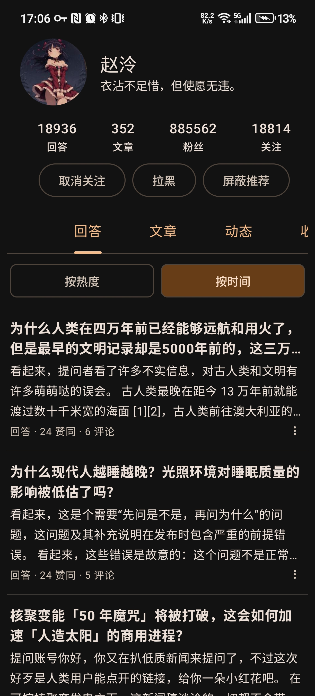
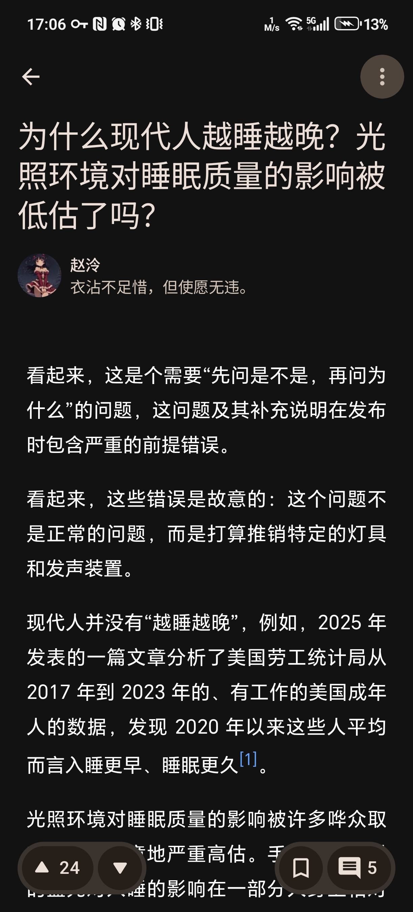

# Zhihu++：注重隐私、互联网个人权利和无广告的知乎客户端

本项目还不够完善，欢迎PR。

Zhihu++独创本地推荐算法，把内容推荐完全放在本地进行，为您提供和筛选高质量内容。
本地推荐算法完全独立于知乎算法，依赖爬虫运行，可以自由定制各种推荐权重，保证看到自己想看的内容。
我相信，这点绵薄之力可以帮助广大用户从大公司的手中夺回本该属于我们的权利——选择自己的生活，不被算法奴役的权利。

知乎手机客户端，蹲坑神器。去广告，去推广软文，去推销带货，去盐选专栏。

支持手机端/网页端/混合等多种推荐方案。

可以设置屏蔽词、AI屏蔽回答、屏蔽用户、屏蔽话题等。

## 应用截图

| 首页 | 关注 | 日报 | 个人主页 | 文章 |
| --- | --- | --- | --- | --- |
|  |  |  |  |  |

## 下载

告别知乎 110MB+ 的客户端，只要不到 4 MB！

[点我下载](https://github.com/zly2006/zhihu-plus-plus/releases)

[下载最新开发版本](https://github.com/zly2006/zhihu-plus-plus/releases/tag/nightly)

> 关于Full和Lite两个版本的说明：
> Full版本包含了一个onnx框架，可以在端侧进行离线AI推理，支持基于LLM embedding的智能内容过滤功能，
> 这实际上主要是本人对端侧AI的技术尝试，实际功能还有很多没开发的，比如人本地知识库（懒）；
> Lite版本不支持智能内容过滤，但体积更小，性能更好。您可以根据自己的需求选择下载哪个版本。

## 捐赠

[爱发电支持作者](https://afdian.com/a/zly2006)

## 路线图

### 已经实现的功能

- 登录与账号
  - 支持手机验证码登录
  - 支持通过扫码在电脑端登录
  - 支持手动设置 Cookie 登录
- 信息流与推荐
  - 首页推荐支持 Web / 安卓 / 本地 / 混合模式
  - 支持切换 **登录状态 / 非登录状态** 下的推荐，防止信息茧房
  - 支持关注页（推荐/动态）、热榜、知乎日报、搜索（含热搜）
  - 支持智能内容过滤、质量过滤、反向屏蔽、过滤统计与屏蔽记录
- 内容浏览
  - 阅读回答
  - 阅读文章
  - 浏览问题详情页（排序、关注、日志、分享、评论）
  - 浏览想法（Pin）详情页（点赞、评论、分享、话题）
  - 浏览收藏夹及收藏夹内容
  - 历史记录（在线历史 + 本地历史）
- 阅读
  - 朗读内容（听文章 / 听回答）
  - 回答页长按保存图片 **无水印**
  - 回答切换手势（上下/左右切换）与“下一个回答”按钮
  - AI 总结内容
  - 导出内容（PDF / 图片 / Markdown）
- 社区互动
    - 支持查看个人主页、关注/拉黑用户、屏蔽推荐
  - 评论区（含子评论、回复、点赞）
  - 通知（支持全部标记已读与通知筛选）
  - 表情包
    - 经典表情`[惊喜]`强势回归！
- 屏蔽系统
  - 屏蔽词（支持正则表达式）
  - NLP 屏蔽词（基于 LLM embedding 和向量相似度匹配，仅 full 版本可用）
  - 屏蔽用户
  - 屏蔽话题
  - **导出屏蔽词** & **导入屏蔽词**（支持跨设备迁移）
- 其他
  - 支持 zse96 v2 签名算法（可以调用 99% 的网页端 API）
  - 支持模拟安卓端 API 调用
  - 支持 Deep Link 与剪贴板链接识别跳转
  - 支持二维码扫码结果展示和复制，可用于提取网址、Wi-Fi 密码等信息

### 遥测

若您同意（可以在设置关闭），本应用会收集一些匿名的数据，用来统计使用量。您可以随时拒绝遥测，这不影响任何功能的使用。我们收集的数据如下：

- 应用启动次数
- 应用启动时间
- 您的IP地址
- 经过SHA256匿名化后的知乎账号ID（如果您登录了的话）

除此之外，我们不会收集任何其他数据，包括但不限于您的浏览记录、推荐算法的输入输出、屏蔽词列表等。

### See Also

如果对其他知乎客户端感兴趣，这些客户端都不需要你root即可使用，也欢迎尝试：

- [Hydrogen](https://github.com/zhihulite/Hydrogen)
- [Zhihu--](https://github.com/huamurui/zhihu-minus-minus) （极早期开发阶段，功能尚有欠缺）

## 贡献者

感谢所有为 Zhihu++ 做出贡献的开发者与用户，正是你们让这个项目持续变得更好。

