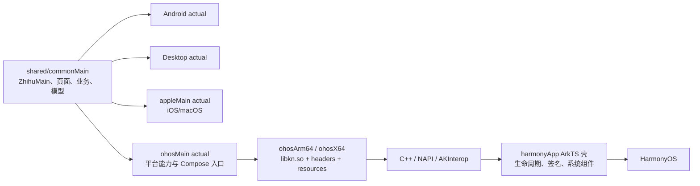

# 通过 CPF-KMP-CMP 适配 HarmonyOS 的可行性分析

## 结论

**结论：有条件可行，值得在 `hmos` 实验分支做限时 PoC；目前不适合直接承诺完整功能或生产发布。**

本项目已经把应用主壳、页面、导航和大量业务逻辑放入 Compose Multiplatform `commonMain`，而 CPF-KMP-CMP 已提供 OHOS Kotlin/Native 目标、Compose 渲染后端、ArkTS 互操作和一批鸿蒙化依赖。因此，这条路线不是从零重写 UI，技术方向与项目现状高度匹配。

真正的难点不是显示一个 Compose 页面，而是让本项目的**完整依赖闭包**落到 CPF 的版本线上：当前项目使用 Kotlin 2.4.0、Compose 1.11.1、Lifecycle 2.10.0、Room 2.8.4、Ktor/Coil 3.5.0，并包含自维护的 Markdown、LaTeX、代码高亮模块；CPF 1.0.0 则建立在 Kotlin 2.2.21 与 Compose 1.9.2 上，部分适配库版本更旧或 API 线不同。它不能被视为“增加两个 Gradle target”这种低成本改动。

建议把目标拆成三层：

| 目标 | 判断 | 前提 |
| --- | --- | --- |
| 编译并运行共享 Compose 页面 | 高可行 | CPF 工具链、仓库和签名链可复现 |
| 只读首页、文章阅读等纵向功能切片 | 中高可行 | Ktor、Coil、Navigation、Lifecycle 和内容渲染依赖闭包跑通 |
| 登录、数据库、Web 风控、分享、图片、通知等可用 MVP | 中等可行 | Room/SQLite 路线确定，并完成一组真实 `ohosMain actual` 与 ArkUI 互操作 |
| 与 Android 端接近的生产级功能和质量 | 尚不能确认 | 真机性能、生命周期、输入、无障碍、长文与发布链全部通过验收 |

最合理的决策是：**先做 10～15 个工作日的技术 PoC，再决定是否进入 MVP；在 PoC 前不做完整迁移排期。**

## 分析边界与资料基线

本报告基于 2026-09-01 的静态文档与源码审计，没有把官方能力描述当作本项目的真机验证结果。

- 项目分支：`hmos`
- 项目基线：`22f6313cae94e1bca50a80bc2c52c557ba9fbfe1`
- CPF 文档入口：[AtomGit 文档仓库](https://atomgit.com/CPF-KMP-CMP/docs)
- CPF 文档镜像/当前可访问仓库：[GitCode 文档仓库](https://gitcode.com/CPF-KMP-CMP/docs)
- 审计的 CPF 文档提交：`aa6ed1e2a256b9d7dadb11dbc91be8087ceda38a`，提交时间 2026-08-15
- 审计的示例提交：`ba263f3dd9950924d45ef3f055518d77a7ad2f17`，分支 `cmp-example`，提交时间 2026-07-09

边界说明：

1. 本次没有把 CPF 工具链接入项目，也没有生成 HAP、安装真机或运行性能测试。
2. CPF 文档中的性能目标和组件支持范围属于框架方材料，仍需用 Zhihu++ 的真实页面与数据复测。
3. 文档、示例和发布包之间存在版本时间差；报告对未在示例中实际出现的 1.0.0 能力均按“待 PoC 验证”处理。

## CPF-KMP-CMP 能提供什么

根据 [1.0.0 发布说明](https://gitcode.com/CPF-KMP-CMP/docs/blob/main/zh-cn/release-notes/KMP-v2.2.21-1.0.0%26CMP-v1.9.2-1.0.0.md) 和 [框架介绍](https://gitcode.com/CPF-KMP-CMP/docs/blob/main/zh-cn/入门/框架介绍.md)，当前发布线的关键组成如下。

### 编译与宿主

- Kotlin `2.2.21-1.0.0`，Compose Multiplatform/Core `1.9.2-1.0.0`，Skiko `0.9.22.2-1.0.0`，AKInterop `1.0.0`。
- 新增 `ohosArm64` 与 `ohosX64` Kotlin/Native 目标，可生成 `sharedLib`、`staticLib` 和 `kexe`。
- 支持在 Windows x64、macOS Arm64/x64、Linux x64 主机编译 OHOS Arm64/x64 产物。
- HarmonyOS 侧由 ArkTS 壳承载 Kotlin/Native 动态库，通过 NAPI/AKInterop 互调；典型产物是 `libkn.so` 与 `libkn_api.h`。
- 基线要求为 DevEco Studio 6.0+、HarmonyOS SDK API 17+；部分能力需要更高 API Level。

### 两种 Compose 渲染路径

| 路径 | 最低系统 | 优点 | 对本项目的主要风险 |
| --- | --- | --- | --- |
| 自渲染 `skia` | API 17、OpenGL ES 3.0 | XComponent + Skia；路径独立，适合先验证纯 Compose UI、长列表和自绘内容 | 包体更大；Web、视频等原生组件需要叠层互操作；必须实测复杂长文与公式 |
| 统一渲染 `fusion-renderer` | API 19 | OHRender/ArkUI RenderNode；更适合 Web、地图、视频等 ArkUI 组件混排 | API 19 以下不可用；API 22 前后互操作路径不同；C-API RenderNode 在较新 ROM 才稳定 |

[自渲染文档](https://gitcode.com/CPF-KMP-CMP/docs/blob/main/zh-cn/UI开发/CMP自渲染用户手册.md)说明其基于 XComponent、Skia 和 OpenGL ES；[统一渲染文档](https://gitcode.com/CPF-KMP-CMP/docs/blob/main/zh-cn/UI开发/CMP统一渲染用户手册.md)说明其支持 API 19+，API 22+ 使用 RenderNode 混排，低版本使用叠层模式。统一渲染的 C-API RenderNode 路径要求 HarmonyOS 6.0.0.45+，文档标注 6.0.0.107+ 更稳定。

### 已有组件和生态

CPF 1.0.0 声明已验证 `compose.runtime`、`compose.ui`、`compose.foundation`、`compose.material` 和 `compose.material3`。官方 [三方库清单](https://gitcode.com/CPF-KMP-CMP/docs/blob/main/zh-cn/深入开发/三方库.md)还包含 Coroutines、Serialization、Datetime、Kotlinx IO、Ktor、Coil、Room3、SQLite、SQLDelight、Multiplatform Settings 等鸿蒙化版本。

这说明项目需要的基础类型大多已有候选实现，但“库名存在”不等于“当前版本和全部模块兼容”。特别是 Lifecycle、Room、Material3 以及项目自维护渲染库，必须做实际依赖解析和编译验证。

### 工具链的工程含义

CPF 示例不是单一 Gradle 应用。它由两部分组成：

1. KMP/CMP 模块编译 `ohosArm64`、`ohosX64`，输出 `libkn.so`、头文件和 Compose 资源；
2. `harmonyApp` ArkTS 工程通过 CMake/NAPI 装载产物，负责页面、生命周期、签名、打包和推送。

官方 [Gradle 插件手册](https://gitcode.com/CPF-KMP-CMP/docs/blob/main/zh-cn/深入开发/KMP%26CMP-Gradle插件用户手册.md)要求 Kotlin、Compose、Compose Compiler、Skiko 和 OHPM 的 `@cpf-kmp-cmp/compose` 版本成套匹配。资源还要复制到与生成包名完全一致的 `rawfile/composeResources/...` 路径。

## 本项目为什么适合这条路线

### 已经存在真正的共享 UI

[`ZhihuMain`](../shared/src/commonMain/kotlin/com/github/zly2006/zhihu/ui/ZhihuMain.kt) 是项目顶层体验的唯一共享主壳，负责主 Tab、导航、页面路由、阅读播放器等。Android、Desktop 和 macOS 宿主向它注入平台能力，而不是各自维护第二套页面树。这正是 CPF 希望承载的应用形态。

当前源码规模如下：

| 源集/模块 | Kotlin 文件 | 约合代码行 |
| --- | ---: | ---: |
| `shared/commonMain` | 183 | 52,271 |
| `shared/androidMain` | 35 | 6,157 |
| `shared/jvmMain` | 19 | 2,389 |
| `shared/nativeMain` | 19 | 1,547 |
| `shared/iosMain` | 5 | 187 |
| `shared/macosMain` | 10 | 1,123 |
| `third_party/markdown` | 138 | 23,990 |
| `third_party/latex` | 121 | 23,747 |
| `third_party/codehigh` | 53 | 5,473 |

这意味着 UI、业务模型和内容处理有很高的理论复用上限。鸿蒙端应继续调用同一个 `ZhihuMain`，不应再复制一套 ArkUI 页面实现。

### 平台边界已经显式化

`shared/commonMain` 当前有 81 个顶层 `expect` 声明，覆盖登录、账号存储、网络引擎、文件、图片、分享、剪贴板、返回键、系统栏、WebView、TTS、更新、通知、数据库等能力。工作量不小，但边界清楚，比从散落的 Android API 中抽取平台层更可控。

平台能力还带有 `is...Supported` 一类显式开关。鸿蒙首版可以合法关闭尚未实现的功能，但不能提供会静默失败、假成功或损坏数据的空 `actual`。

## 不能直接接入的地方

### 1. 核心版本线整体错位

| 组件 | 本项目 | CPF 文档/适配线 | 判断 |
| --- | --- | --- | --- |
| Kotlin / Compose Compiler | 2.4.0 | 2.2.21-1.0.0 | 必须验证降级源码兼容；插件不能随意混用 |
| Compose Multiplatform | 1.11.1 | 1.9.2-1.0.0 | 高风险；UI/API 和产物元数据均可能不兼容 |
| Material3 | 强制 `1.10.0-alpha05` | CPF 1.9.2 组件线 | 高风险；项目依赖 `material-kolor` 的严格版本约束 |
| Coroutines | 1.11.0 | 1.10.2-1.0.0 | 通常可控，但全图必须使用 OHOS 变体 |
| Serialization | 1.11.0 | 1.9.1-1.0.0 | 需验证编译器插件与序列化格式兼容 |
| Ktor | 3.5.0 | 3.3.3-1.0.0 | 需改为 CPF CIO 等 OHOS 变体并回归 Cookie/TLS/流式请求 |
| Coil | 3.5.0 | 3.3.0-1.0.0 | 需验证网络、GIF、缓存与 Compose 图片接口 |
| Datetime | 0.8.0 | 0.7.1-1.0.0 | 可能需要小范围 API 回退 |
| Kotlinx IO | 0.8.1 | 0.9.0-1.0.0 | 版本方向不同，需编译验证 |
| Navigation Compose | 2.9.2 | 文档示例为 2.9.4-0.3.0 | typed route 必须在 OHOS 上验证；文档版本尚未统一到 1.0.0 后缀 |
| Lifecycle Compose/ViewModel | 2.10.0，位于 `commonMain` | 官方组件指南把 Lifecycle 放在 Android 侧 | 当前 30 个 common 文件依赖 Lifecycle，是关键阻塞项 |
| Room / SQLite | 2.8.4 / 2.6.2 | Room3 `3.0.0-alpha01-0.3.0` / SQLite `2.7.0-alpha01-0.3.0` | 不是直接换坐标；涉及编译器、schema、驱动和迁移 |
| AGP | 9.3.1 | 官方示例为 8.6.0 | 示例不等于上限，但必须验证 CPF Gradle 插件兼容区间 |

[`shared/build.gradle.kts`](../shared/build.gradle.kts) 还在 `commonMain` 使用 `material-kolor 4.1.1`、`ksoup 0.2.6`、`aboutlibraries-compose-m3 15.0.0`。这些库不在本次审计的 CPF 官方适配清单中。它们可能是纯 Kotlin、可以自行补 OHOS target，也可能因为传递依赖或 Compose ABI 无法直接使用；在 PoC 前不能假设兼容。

CPF 文档 FAQ 还明确警告 `org.jetbrains.androidx` 与 `androidx` 同类产物混用会产生重复类。当前项目同时有 common 的 JetBrains AndroidX 和 Android 平台依赖，接入时必须逐 configuration 检查依赖树，不能全局粗暴替换 Android 端坐标。

### 2. 当前 `nativeMain` 实际是 Apple 实现

项目现有 `nativeMain` 不是 OHOS 可复用的通用 Native 层，其中多处直接导入 Foundation 或 Darwin：

- [`AccountHttpClientEngine.native.kt`](../shared/src/nativeMain/kotlin/com/github/zly2006/zhihu/account/AccountHttpClientEngine.native.kt) 使用 Ktor Darwin；
- [`NativeAccountStore.kt`](../shared/src/nativeMain/kotlin/com/github/zly2006/zhihu/account/NativeAccountStore.kt) 使用 `NSFileManager`、`NSString`；
- [`NativePlatformCapabilities.kt`](../shared/src/nativeMain/kotlin/com/github/zly2006/zhihu/platform/NativePlatformCapabilities.kt) 使用 `NSData`、`NSFileManager`；
- Markdown、历史记录、设置和子页面运行时也包含 Foundation API。

如果直接增加 OHOS target 并让它进入当前默认 Native 层，编译会在 Apple API 上失败。推荐先把层级整理为：

```text
commonMain
├── androidMain
├── jvmMain
├── appleMain
│   ├── iosMain
│   └── macosMain
└── ohosMain
    ├── ohosArm64Main
    └── ohosX64Main
```

真正与平台无关的 Native 代码可以保留在额外的通用层；Foundation、Darwin 和 Apple 文件路径必须下沉到 `appleMain`。CPF 示例让 `ohosMain` 直接依赖 `commonMain`，也佐证了不应把 OHOS 强行塞进现有 Apple Native 实现。

### 3. Lifecycle 与 Navigation 需要先做依赖尖峰

本项目共有 30 个 `commonMain` 文件使用 Lifecycle/ViewModel，`ZhihuMain` 和文章页面使用 typed Navigation。CPF 的组件手册给出了 OHOS Navigation 依赖示例，但使用的是 `2.9.4-0.3.0`；同一手册把 Lifecycle Compose/ViewModel 作为 Android 依赖，没有展示 OHOS Native 变体。

因此 PoC 第一阶段必须回答两个二元问题：

1. CPF Maven 仓是否存在与 1.0.0 工具链兼容的 Lifecycle OHOS 产物，且能编译本项目的 ViewModel 使用方式？
2. CPF Navigation 能否编译并正确恢复本项目的 typed route、返回栈和 `NavBackStackEntry` 状态？

若第一个答案是否定的，就需要在“适配/维护 Lifecycle fork”和“把共享 ViewModel 改为不依赖 AndroidX Lifecycle 的状态持有器”之间选择。两者都属于架构改造，不应隐藏在普通移植估算里。

### 4. 数据库不是平移

[`shared-local-db`](../shared-local-db/build.gradle.kts) 使用 Room 2.8.4、SQLite Bundled 2.6.2 和 KSP，为内容缓存与屏蔽数据库生成实现。CPF 清单提供的是 Room3 alpha 与 SQLite alpha 的较早适配线，不是当前 Room 2.x 的 OHOS 变体。

可选路线：

| 路线 | 优点 | 代价/风险 |
| --- | --- | --- |
| 迁移到 CPF Room3 | 保留 Room 思维模型和注解 | alpha API、KSP、schema 与现有 Android/Desktop 数据迁移都需验证 |
| 改用 CPF SQLDelight | CPF 已列出 1.0.0 适配；Native 驱动边界更清晰 | 重写 DAO、查询和迁移，影响所有平台 |
| 鸿蒙首版使用独立轻量存储 | 最快解除只读 PoC 阻塞 | 功能受限；不得伪装为完整缓存/屏蔽能力 |

建议 P0/P1 使用内存实现或显式关闭本地数据库功能；P2 单独比较 Room3 与 SQLDelight，不要让数据库先阻塞 UI 和网络可行性验证。

### 5. 内容渲染是项目特有风险

项目内置的 Markdown、LaTeX、代码高亮共 312 个 Kotlin 文件、约 5.3 万行，每个相关 KMP 模块目前都只有 Android/JVM/iOS/macOS target。它们必须逐模块增加 OHOS target，并处理 Skiko、字体、资源和线程调度差异。

Zhihu++ 的真实压力场景包含长回答、复杂列表、可选择文本、代码块、图片和大量公式。CPF 文档给出的通用组件性能目标不能替代现有 [`Markdown renderer 性能报告`](markdown-renderer-performance-report.md) 的真实语料回归。OHOS 需要建立自己的真机基线，至少覆盖：

- 首屏、连续滚动、反向滚动和离屏重入；
- 80 个长公式、300 项列表、200 行表格；
- 文本选择、复制、链接、脚注与图片预览；
- 前后台切换后的缓存、字体与渲染资源恢复；
- 自渲染和统一渲染的相同输入 A/B。

### 6. 平台 `actual` 工作量真实存在

81 个顶层 `expect` 不代表 81 个都很难，但至少要按能力域交付：

| 能力域 | 初步判断 | 推荐首版策略 |
| --- | --- | --- |
| HTTP、Cookie、账号存储、HMAC | 中 | Ktor CIO + OHOS 安全存储/文件 CAPI，先支持游客读取 |
| 返回键、生命周期、主题、系统栏、剪贴板 | 中 | 优先实现，是共享主壳可用的基础 |
| 图片加载、预览、保存、分享、选择 | 中高 | Coil OHOS + ArkTS/CAPI；逐项真机验证 URI 与权限 |
| 二维码、手机号登录 | 中高 | Kotlin 纯算法或 Harmony Scan/图片能力；不得只返回占位结果 |
| Web 登录、风控和旧版 WebView 内容 | 高 | 统一渲染下嵌 ArkUI Web，并建立 Cookie/回调桥；官方未提供开箱即用的 Compose WebView 业务组件 |
| Room 数据库、历史、屏蔽 | 高 | 单独技术选型；PoC 不与 UI 验证捆绑 |
| 通知、TTS、媒体播放、更新安装 | 高 | 通过 ArkTS/系统 CAPI 实现；首版可显式关闭非核心项 |
| NLP、句向量、APK 更新 | 很高或不适用 | HarmonyOS 首版关闭，并从 UI 中移除入口/说明不支持 |

### 7. 许可证与制品来源需要单独审核

CPF 文档仓本身使用 Apache-2.0，本项目使用 AGPL-3.0-only；这两项本身没有显示出阻止技术 PoC 的条件，但不能据此推断 CPF 下所有编译器、Compose fork、三方库 fork 和二进制制品都采用相同许可证。正式分发前需要逐仓库确认许可证、NOTICE、上游修改和源码提供义务，并记录自定义 Maven/OHPM 仓中的实际制品来源。此项属于发布合规审核，不应由本技术报告替代法律判断。

## 推荐目标架构



架构原则：

1. `ZhihuMain` 继续是唯一 UI 主树；ArkTS 壳只做宿主、生命周期和必须的系统组件。
2. `ohosMain` 提供真实平台实现，Apple API 移到 `appleMain`。
3. Web、相机、分享等 ArkUI 能力通过小而明确的互操作接口注入 Compose，不把业务导航搬到 ArkTS。
4. CPF 特有版本、仓库和发布任务与主线配置隔离；实验结论稳定前不污染 `Android-master`。
5. 每个不支持的能力都由 capability flag 关闭入口并给出用户可理解的说明，不使用“成功但什么也没做”的实现。

## 渲染模式建议

不要在项目开始时永久押注某一种渲染模式。

### PoC 首选自渲染

先用 `rendererBackend=skia` 验证：

- 共享 Material3 主壳能否正确显示；
- Lazy 列表、Pager、动画和返回键是否可用；
- 自维护 Markdown/LaTeX 是否能编译和达到可接受帧率；
- Compose 资源、字体、图片和前后台恢复是否稳定。

这条路径把 ArkUI 混排变量降到最低，适合判断“共享 UI 本身能否运行”。

### 同期做统一渲染小样

Web 登录/风控、图片选择和其他系统组件很可能需要 ArkUI 互操作。应另做一个极小的 `fusion-renderer` 小样，至少嵌入 ArkUI Web，验证：

- Compose 与 Web 的尺寸、Z 序、触摸和返回键；
- API 19～21 叠层模式与 API 22+ RenderNode 模式；
- Cookie 注入、页面回调、键盘避让和前后台恢复。

生产默认后端应由这两组真机结果决定，而不是只依据框架宣传或 Hello World。

## 分阶段实施方案

### P0：工具链与依赖闭包，2～4 天

目标是证明 CPF 1.0.0 在当前 Windows 环境可重复构建，不接业务代码。

1. 以官方 `kmp-cmp-example` 为骨架，升级并锁定 1.0.0 全套版本。
2. 同时构建 `ohosArm64` 和 `ohosX64` 的 Debug 共享库。
3. 发布 `libkn.so`、头文件和 Compose 资源到最小 `harmonyApp`。
4. 签名、安装并运行一个 Compose 文本/列表页面。
5. 从全新 Gradle/OHPM 缓存重复一次，记录所有外部仓库和工具版本。

P0 必须特别检查：官方示例在本次审计时仍锁定 Kotlin `2.2.21-0.4.0`、Compose `1.9.2-0.4.0`、Skiko `0.9.22.2-0.4.0`，而发布说明已经是 1.0.0。示例滞后不代表 1.0.0 不可用，但意味着不能直接复制后宣称版本闭包成立。

### P1：共享主壳，3～5 天

1. 建立 `appleMain`/`ohosMain` 源集层级，不改变 Android/macOS 行为。
2. 为一个最薄的共享入口增加 OHOS target 与 export。
3. 先注入内存数据和最小平台能力，显示真实主题、底栏、列表、设置入口。
4. 验证 Navigation、返回键、`onPageShow`/`onPageHide` 和状态恢复。CPF FAQ 明确要求壳实现 `onPageShow()`，否则 ViewModel 状态可能丢失。
5. 验证 Compose 资源路径、深色模式、字体缩放和横竖屏。

### P2：游客首页 → 文章阅读纵向切片，4～6 天

1. 接入 CPF Coroutines、Serialization、Ktor CIO 和 Coil。
2. 使用真实游客接口加载首页，打开一篇回答/文章，显示图片和基础 Markdown。
3. 接入一条最小 Cookie/账号存储路径，但不在此阶段承诺完整登录。
4. 为 Markdown/LaTeX/代码高亮所需模块增加 OHOS target。
5. 在至少一台 API 19～21 和一台 API 22+ 真机或可靠设备环境运行长文压力样本。

### P3：数据库选型，独立 1～3 周

1. 用同一份最小 schema 分别验证 CPF Room3 与 SQLDelight。
2. 检查 KSP、迁移、事务、Flow、并发、数据库路径和异常恢复。
3. 评估是否能够维持 Android/Desktop 现有数据库格式；不能时必须设计明确迁移或平台独立数据库，不能静默丢数据。
4. 选型后再接历史、缓存和屏蔽功能。

### P4：登录与系统能力，2～5 周

按业务价值依次实现：二维码/手机号登录、Web 风控、图片、分享、剪贴板、通知、TTS、媒体和更新。每个能力同时补 capability flag、错误路径和生命周期测试。

### P5：生产化，持续工作

- 真机矩阵、无障碍、输入法、字体、折叠屏/窗口、功耗与内存；
- Release 链接、混淆/符号、崩溃栈、签名、上架与增量升级；
- 冷启动、前后台、低内存回收、网络切换和长会话；
- Android/Desktop/macOS 回归，确保 CPF 相关改造没有破坏现有平台。

## PoC 验收与停止条件

### 通过条件

只有同时达到以下条件，才建议继续投入 MVP：

1. `ohosArm64`、`ohosX64` 可从干净缓存重复构建，Release 至少能链接一次。
2. HAP 能签名、安装、冷启动，并连续前后台切换和运行 30 分钟无崩溃/黑屏。
3. 使用真实 `ZhihuMain` 或其最小裁剪入口，而不是重新实现 ArkUI 页面。
4. typed Navigation、返回栈和 `onPageShow` 后状态恢复可用。
5. 游客首页、文章正文、网络图片和一篇公式长文形成端到端链路。
6. 关键依赖均来自可追踪版本；没有动态版本、手工替换本地 klib 或未记录补丁。
7. 未实现功能均明确关闭；没有假数据库、假分享、假登录等静默实现。
8. 自渲染与统一渲染至少各完成一次针对本项目的真实页面验证。

### 停止或重新选型条件

出现任一情况，应暂停“共享完整 Compose UI”路线，评估 KMP 逻辑共享 + ArkUI UI 或等待 CPF 升级：

- Lifecycle/Navigation 无 OHOS 可用闭包，且修复要求长期维护大型 AndroidX fork；
- Kotlin/Compose 降级导致大量核心页面无法编译，改造会反向破坏现有平台；
- Room、内容渲染和关键三方库需要同时维护多套私有 fork；
- 长文、公式或列表在代表性真机上无法达到基本可读和可交互水平；
- 构建依赖私有/不稳定仓库，无法在干净 CI 中复现；
- Web 登录/风控无法可靠完成 Cookie、输入和回调闭环。

## 风险矩阵

| 风险 | 概率 | 影响 | 处理方式 |
| --- | --- | --- | --- |
| Kotlin/Compose 全局降级和 ABI 错位 | 高 | 极高 | `hmos` 独立锁版本；P0 先做源码/API 编译清单，不直接改主线 |
| Lifecycle OHOS 产物未被官方示例证明 | 高 | 极高 | 先做最小 ViewModel/Lifecycle 尖峰；准备去 AndroidX Lifecycle 的替代设计 |
| Room 2.x 无直接 OHOS 路径 | 高 | 高 | 数据库独立选型，不阻塞 UI/网络 PoC |
| Material3 与 `material-kolor` 严格约束冲突 | 高 | 高 | 先使用 CPF 自带 Material3；动态色能力可在鸿蒙首版禁用或局部替代 |
| `ksoup`、AboutLibraries 等无官方适配 | 中高 | 高 | 检查是否纯 Kotlin；必要时内置、替换或关闭非核心页面 |
| Apple API 污染 `nativeMain` | 确定存在 | 高 | 先建立 `appleMain`，OHOS 直接依赖 `commonMain` |
| Markdown/LaTeX/字体/Skia 性能回退 | 中高 | 高 | 真实语料、双渲染后端、真机性能门槛 |
| Web 登录与风控互操作不稳定 | 中高 | 高 | Fusion Renderer + ArkUI Web 独立样例，先验证 Cookie 和生命周期 |
| CPF 文档、示例、发布版本不同步 | 高 | 中高 | 固定 commit 和制品校验；每次升级跑完整 P0 |
| 自定义 Maven/OHPM 仓可用性与供应链 | 中 | 高 | CI 冷缓存验证、校验和/SBOM、必要时做合规的制品镜像 |
| 各 CPF fork 的许可证与 NOTICE 未逐项审计 | 中 | 高 | 上线前做制品级许可证清单，不用文档仓许可证代替组件审计 |
| 输入法、字体族和无障碍差异 | 中 | 中高 | 真机验收；自带关键字体；不要假设 Android 行为一致 |

CPF [组件限制说明](https://gitcode.com/CPF-KMP-CMP/docs/blob/main/zh-cn/UI开发/CMP组件库用户手册.md)已记录输入自动大写/纠错不稳定，以及通用字体族在鸿蒙上可能映射得很接近。本项目有登录、搜索、评论、编辑和复杂文本展示，这些差异必须进入产品验收，不只是编译测试。

## 路线比较

| 路线 | UI 复用 | 首版速度 | 长期维护 | 结论 |
| --- | ---: | ---: | ---: | --- |
| CPF-KMP-CMP 共享业务与 Compose UI | 最高 | 中低 | 成功后最低，但依赖 CPF 生态 | **推荐作为实验主路线** |
| KMP 共享逻辑，HarmonyOS 用 ArkUI 重写 UI | 中 | 中 | 两套 UI 长期并行 | CPF UI 路线失败时的回退方案 |
| 独立 ArkTS 实现全部功能 | 最低 | 若已有代码则短期可能更快 | 最高 | 可作系统能力和行为参考，不宜成为共享 UI 的第二真相源 |

## 工作量量级

以下只用于资源规划，必须在 P0/P1 后重新估算：

| 里程碑 | 粗略量级 | 输出 |
| --- | --- | --- |
| 工具链 + 共享 UI/游客阅读 PoC | 10～15 个工作日 | 可运行样例、依赖闭包、性能初测、继续/停止结论 |
| 可用 MVP | 10～18 人周 | 首页、阅读、基础登录、图片、最小存储和主要系统能力 |
| 接近现有端的生产质量 | 24～48+ 人周 | 数据迁移、完整平台能力、设备矩阵、性能/无障碍/发布工程 |

最大不确定项依次是 Lifecycle、数据库、Material3/第三方依赖、Web 登录和内容渲染性能。任何一个都可能显著扩大后两档工作量。

## 最终建议

1. 保留 `hmos` 作为 CPF 专用实验线，不把 Kotlin/Compose 降级直接同步回 `Android-master`。
2. 第一提交只加入最小 CPF 1.0.0 probe 与 `harmonyApp` 宿主，证明干净构建和设备启动。
3. 第二阶段先解决 `appleMain`/`ohosMain` 层级，再接共享 UI；不要复制页面到 ArkTS。
4. 将 Lifecycle/Navigation、数据库、ArkUI Web、Markdown/LaTeX 分成四个独立技术尖峰，每个都有可停止结论。
5. 以游客首页 → 文章阅读作为首个真实纵向切片；完整登录和数据库后置。
6. 只有 PoC 验收全部通过，才承诺 MVP；否则保留 KMP 逻辑共享 + ArkUI UI 作为明确回退路线。

总体判断不是“CPF 已经让项目自动支持鸿蒙”，而是：**CPF 首次让本项目复用同一套 Kotlin/Compose UI 成为现实可验证的工程选项；以当前生态成熟度，能否生产化仍取决于一次严格、限时、以依赖闭包和真机证据为核心的 PoC。**

## 参考资料

- [CPF-KMP-CMP 文档](https://atomgit.com/CPF-KMP-CMP/docs)
- [CPF 文档仓许可证](https://gitcode.com/CPF-KMP-CMP/docs/blob/main/LICENSE)
- [CPF 1.0.0 发布说明](https://gitcode.com/CPF-KMP-CMP/docs/blob/main/zh-cn/release-notes/KMP-v2.2.21-1.0.0%26CMP-v1.9.2-1.0.0.md)
- [框架介绍](https://gitcode.com/CPF-KMP-CMP/docs/blob/main/zh-cn/入门/框架介绍.md)
- [CMP 组件库用户手册](https://gitcode.com/CPF-KMP-CMP/docs/blob/main/zh-cn/UI开发/CMP组件库用户手册.md)
- [CMP 自渲染用户手册](https://gitcode.com/CPF-KMP-CMP/docs/blob/main/zh-cn/UI开发/CMP自渲染用户手册.md)
- [CMP 统一渲染用户手册](https://gitcode.com/CPF-KMP-CMP/docs/blob/main/zh-cn/UI开发/CMP统一渲染用户手册.md)
- [KMP&CMP Gradle 插件用户手册](https://gitcode.com/CPF-KMP-CMP/docs/blob/main/zh-cn/深入开发/KMP%26CMP-Gradle插件用户手册.md)
- [三方库适配清单](https://gitcode.com/CPF-KMP-CMP/docs/blob/main/zh-cn/深入开发/三方库.md)
- [CPF FAQ](https://gitcode.com/CPF-KMP-CMP/docs/tree/main/zh-cn/faqs)
- [kmp-cmp-example](https://gitcode.com/CPF-KMP-CMP/kmp-cmp-example/tree/cmp-example)
